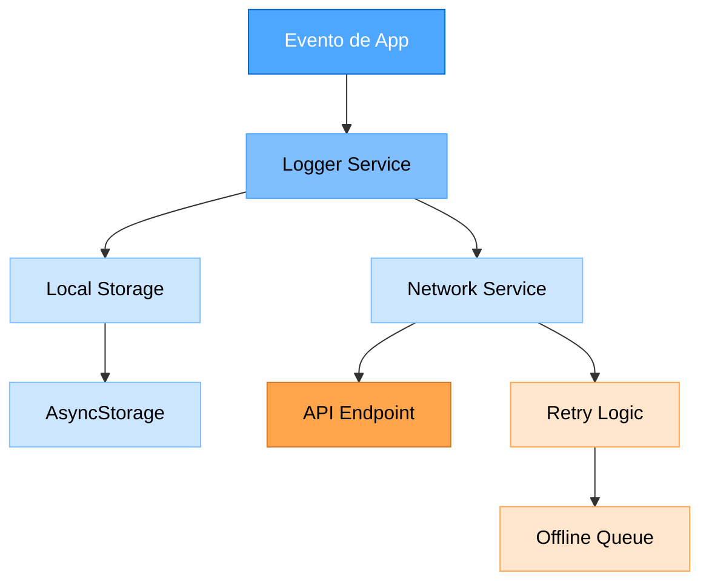

# 📋 PLAN DE IMPLEMENTACIÓN - LOG DE EVENTOS Y DIAGNÓSTICO DE RED

## 🎯 **OBJETIVO**
Implementar un sistema completo de Log de eventos para Android y diagnosticar/resolver problemas de conexión (CORS, HTTP, etc.) en el proyecto Factura Móvil 2025.

---

## 📊 **ANÁLISIS DE COMPLEJIDAD**

### **NIVEL: 3 (INTERMEDIO-AVANZADO)**
- **Alcance**: Sistema completo de logging + diagnóstico de red
- **Componentes**: 11 archivos nuevos + modificaciones a existentes
- **Tiempo estimado**: 4 días
- **Fases creativas**: 3 componentes requieren diseño UI/UX

---

## 🏗️ **ARQUITECTURA PROPUESTA**

### **Componentes del Sistema de Log**



### **Estructura de Archivos Propuesta**

```
utils/
├── logger/
│   ├── LoggerService.ts          # Servicio principal de logging
│   ├── LogLevel.ts               # Enumeración de niveles
│   ├── LogEntry.ts               # Interfaz de entrada de log
│   ├── LogStorage.ts             # Almacenamiento local
│   ├── LogNetwork.ts             # Envío a servidor
│   └── LogUtils.ts               # Utilidades de logging
├── network/
│   ├── NetworkDiagnostic.ts      # Diagnóstico de red
│   ├── ConnectionTester.ts       # Testing de conexión
│   └── NetworkMonitor.ts         # Monitoreo de estado
└── debugging/
    ├── DebugPanel.tsx            # Panel de debugging
    └── NetworkLogViewer.tsx      # Visor de logs de red
```

---

## 📝 **PLAN DE IMPLEMENTACIÓN DETALLADO**

### **FASE 1: SISTEMA DE LOGGING (Días 1-2)**

#### **1.1 Crear Estructura Base**
- [ ] Crear carpeta `utils/logger/`
- [ ] Definir interfaces y tipos (`LogLevel.ts`, `LogEntry.ts`)
- [ ] Implementar `LoggerService.ts` con niveles de log
- [ ] Crear `LogStorage.ts` para persistencia local

#### **1.2 Implementar Almacenamiento**
- [ ] Configurar AsyncStorage para logs
- [ ] Implementar rotación de logs (máximo 1000 entradas)
- [ ] Crear funciones de limpieza automática
- [ ] Agregar compresión de logs antiguos

#### **1.3 Servicio de Red**
- [ ] Implementar `LogNetwork.ts` para envío a servidor
- [ ] Configurar retry logic con backoff exponencial
- [ ] Crear cola offline para logs pendientes
- [ ] Implementar batch sending (máximo 50 logs por batch)

### **FASE 2: DIAGNÓSTICO DE RED (Días 2-3)**

#### **2.1 Herramientas de Diagnóstico**
- [ ] Crear `NetworkDiagnostic.ts`
- [ ] Implementar ping a servidor API
- [ ] Crear test de conectividad HTTP/HTTPS
- [ ] Implementar verificación de CORS headers

#### **2.2 Monitoreo de Conexión**
- [ ] Crear `NetworkMonitor.ts`
- [ ] Implementar detección de cambios de red
- [ ] Crear alertas de conectividad
- [ ] Implementar métricas de performance

#### **2.3 Testing de Endpoints**
- [ ] Crear `ConnectionTester.ts`
- [ ] Implementar tests para cada endpoint
- [ ] Crear reportes de latencia
- [ ] Implementar detección de timeouts

### **FASE 3: INTEGRACIÓN Y UI (Días 3-4)**

#### **3.1 Integración con Servicios Existentes**
- [ ] Modificar `services/api.ts` para incluir logging
- [ ] Integrar logging en `AuthContext`
- [ ] Agregar logs en componentes críticos
- [ ] Implementar error boundary con logging

#### **3.2 Panel de Debugging**
- [ ] Crear `DebugPanel.tsx` para desarrollo
- [ ] Implementar visor de logs en tiempo real
- [ ] Crear filtros por nivel y fecha
- [ ] Agregar exportación de logs

#### **3.3 Configuración**
- [ ] Agregar configuración de logging en settings
- [ ] Implementar toggle para debug mode
- [ ] Crear configuración de niveles por ambiente
- [ ] Agregar opciones de retención de logs

### **FASE 4: TESTING Y OPTIMIZACIÓN (Día 4)**

#### **4.1 Testing**
- [ ] Crear tests unitarios para LoggerService
- [ ] Implementar tests de integración para red
- [ ] Crear tests de performance
- [ ] Validar funcionamiento en Android

#### **4.2 Optimización**
- [ ] Optimizar tamaño de logs
- [ ] Implementar lazy loading de logs
- [ ] Optimizar envío de batches
- [ ] Reducir impacto en performance

---

## 🔧 **COMPONENTES AFECTADOS**

### **Archivos a Modificar**
- `services/api.ts` - Agregar logging de requests/responses
- `context/AuthContext.tsx` - Log de eventos de autenticación
- `app/(auth)/login.tsx` - Log de intentos de login
- `components/` - Agregar logging en componentes críticos

### **Archivos a Crear**
- `utils/logger/` - 6 archivos nuevos
- `utils/network/` - 3 archivos nuevos
- `utils/debugging/` - 2 archivos nuevos
- `types/logger.d.ts` - Tipos para logging

### **Configuraciones a Actualizar**
- `app.config.js` - Configuración de logging
- `package.json` - Dependencias para debugging
- `.env` - Variables de entorno para logging

---

## ⚠️ **DESAFÍOS Y SOLUCIONES**

### **Desafío 1: Performance**
- **Problema**: Logging puede impactar performance
- **Solución**: Async logging, batch processing, niveles configurables

### **Desafío 2: Almacenamiento**
- **Problema**: Logs pueden llenar almacenamiento
- **Solución**: Rotación automática, compresión, límites configurables

### **Desafío 3: Red**
- **Problema**: Envío de logs puede fallar
- **Solución**: Cola offline, retry logic, fallback local

### **Desafío 4: CORS/HTTP**
- **Problema**: Problemas de conectividad persistentes
- **Solución**: Diagnóstico detallado, configuración de red, testing exhaustivo

---

## 🎨 **COMPONENTES QUE REQUIEREN FASE CREATIVA**

### **1. Panel de Debugging** 🎨
- **Tipo**: UI/UX Design
- **Necesidad**: Interfaz intuitiva para visualizar logs
- **Consideraciones**: Filtros, búsqueda, exportación, diseño responsive

### **2. Visualización de Métricas de Red** 🎨
- **Tipo**: Data Visualization
- **Necesidad**: Gráficos de latencia, errores, conectividad
- **Consideraciones**: Charts, real-time updates, alertas visuales

### **3. Configuración de Logging** 🎨
- **Tipo**: Settings UI
- **Necesidad**: Interfaz para configurar niveles y retención
- **Consideraciones**: UX intuitiva, validación, preview de configuración

---

## 📊 **MÉTRICAS DE ÉXITO**

### **Funcionalidad**
- [ ] Sistema de logging funcionando en Android
- [ ] Logs persistiendo localmente y enviándose al servidor
- [ ] Diagnóstico de red identificando problemas específicos
- [ ] Panel de debugging accesible y funcional

### **Performance**
- [ ] Impacto en performance < 5%
- [ ] Tiempo de respuesta de logging < 100ms
- [ ] Uso de almacenamiento < 10MB para logs
- [ ] Envío de logs sin bloquear UI

### **Confiabilidad**
- [ ] 99% de logs enviados exitosamente
- [ ] Recuperación automática de errores de red
- [ ] No pérdida de logs en crashes
- [ ] Diagnóstico preciso de problemas de conexión

---

## 🚀 **PRÓXIMOS PASOS**

### **Inmediatos**
1. **Crear estructura de carpetas** para logging
2. **Implementar LoggerService** básico
3. **Diagnosticar problemas de red** actuales
4. **Crear plan de testing** para cada componente

### **Corto Plazo**
1. **Integrar logging** en servicios existentes
2. **Implementar panel de debugging**
3. **Optimizar performance** del sistema
4. **Documentar** uso y configuración

### **Mediano Plazo**
1. **Analytics avanzados** basados en logs
2. **Alertas automáticas** para problemas críticos
3. **Dashboard de métricas** en tiempo real
4. **Integración con herramientas** de monitoreo externas

---

## ✅ **CHECKLIST DE IMPLEMENTACIÓN**

### **Fase 1: Logging Base**
- [ ] Estructura de carpetas creada
- [ ] Interfaces y tipos definidos
- [ ] LoggerService implementado
- [ ] Almacenamiento local funcionando
- [ ] Tests básicos pasando

### **Fase 2: Diagnóstico de Red**
- [ ] NetworkDiagnostic implementado
- [ ] Tests de conectividad funcionando
- [ ] Monitoreo de red activo
- [ ] Reportes de latencia generados

### **Fase 3: Integración**
- [ ] Logging integrado en API service
- [ ] Panel de debugging creado
- [ ] Configuración implementada
- [ ] UI responsive y funcional

### **Fase 4: Testing**
- [ ] Tests unitarios completos
- [ ] Tests de integración pasando
- [ ] Performance validada
- [ ] Documentación actualizada

---

## 📋 **REQUISITOS TÉCNICOS**

### **Dependencias Necesarias**
```json
{
  "dependencies": {
    "react-native-device-info": "^10.0.0",
    "react-native-network-info": "^5.2.1",
    "react-native-fs": "^2.20.0"
  },
  "devDependencies": {
    "@types/react-native-device-info": "^10.0.0"
  }
}
```

### **Configuración de Entorno**
```bash
# Variables de entorno para logging
EXPO_PUBLIC_LOG_LEVEL=INFO
EXPO_PUBLIC_LOG_ENDPOINT=https://logs.facturamovil.cl/api/logs
EXPO_PUBLIC_LOG_BATCH_SIZE=50
EXPO_PUBLIC_LOG_RETENTION_DAYS=30
```

### **Permisos Android**
```xml
<!-- Permisos adicionales para logging -->
<uses-permission android:name="android.permission.READ_PHONE_STATE" />
<uses-permission android:name="android.permission.ACCESS_NETWORK_STATE" />
<uses-permission android:name="android.permission.WRITE_EXTERNAL_STORAGE" />
```

---

## 🔍 **DIAGNÓSTICO DE PROBLEMAS DE CONEXIÓN**

### **Problemas Identificados**
1. **CORS**: Cross-Origin Resource Sharing
2. **HTTP Cleartext**: Android 9+ bloquea HTTP por defecto
3. **Timeouts**: Conexiones lentas o inestables
4. **DNS**: Problemas de resolución de nombres
5. **Firewall**: Bloqueos a nivel de red

### **Herramientas de Diagnóstico**
- **Ping Test**: Verificar conectividad básica
- **HTTP Test**: Verificar endpoints específicos
- **CORS Test**: Verificar headers de CORS
- **Latency Test**: Medir tiempos de respuesta
- **Network State**: Monitorear cambios de red

### **Soluciones Propuestas**
1. **Configuración de Red**: Ya implementada (network_security_config.xml)
2. **Retry Logic**: Implementar en LoggerService
3. **Fallback Mechanisms**: Múltiples endpoints de backup
4. **Offline Mode**: Funcionamiento sin conexión
5. **Progressive Enhancement**: Degradación graceful

---

## 📈 **BENEFICIOS ESPERADOS**

### **Para Desarrollo**
- **Debugging mejorado**: Logs detallados de errores
- **Performance monitoring**: Métricas de rendimiento
- **User behavior**: Análisis de uso de la aplicación
- **Error tracking**: Identificación rápida de problemas

### **Para Producción**
- **Monitoring**: Monitoreo en tiempo real
- **Alerting**: Alertas automáticas para problemas
- **Analytics**: Datos de uso y performance
- **Maintenance**: Mantenimiento proactivo

### **Para Usuarios**
- **Stability**: Aplicación más estable
- **Performance**: Mejor rendimiento
- **Reliability**: Mayor confiabilidad
- **Support**: Soporte técnico mejorado

---

## 🎯 **CONCLUSIÓN**

Este plan proporciona una hoja de ruta completa para implementar un sistema robusto de logging y diagnóstico de red. La implementación se divide en fases manejables con componentes que requieren fases creativas claramente identificadas.

### **Valor Agregado**
- **Debugging avanzado**: Herramientas profesionales de debugging
- **Monitoreo proactivo**: Detección temprana de problemas
- **Analytics**: Datos valiosos para mejoras
- **Mantenimiento**: Reducción de tiempo de resolución de problemas

### **Escalabilidad**
- **Modular**: Componentes independientes y reutilizables
- **Configurable**: Adaptable a diferentes necesidades
- **Extensible**: Fácil agregar nuevas funcionalidades
- **Mantenible**: Código limpio y bien documentado

---

**Fecha de creación**: Diciembre 2024  
**Versión del plan**: 1.0.0  
**Estado**: Documentado para implementación futura  
**Complejidad**: Nivel 3 (Intermedio-Avanzado)  
**Tiempo estimado**: 4 días  

---

> **Este plan detallado proporciona una base sólida para implementar un sistema profesional de logging y diagnóstico de red en el proyecto Factura Móvil 2025, mejorando significativamente la capacidad de debugging, monitoreo y mantenimiento de la aplicación.**
