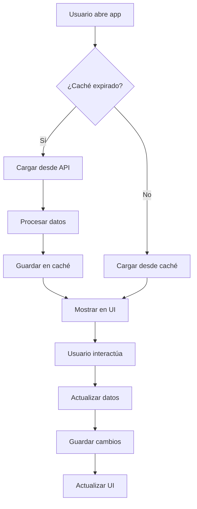

# 📊 **FASE 3 & 4 COMPLETADAS - ANÁLISIS DE CLIENTES**

**📅 Fecha:** 23 de Agosto, 2025  
**🎯 Estado:** ✅ **FASE 3 & 4 COMPLETADAS - INTEGRACIÓN Y GRÁFICOS**

---

## 🚀 **RESUMEN EJECUTIVO**

Se han completado exitosamente las **Fases 3 y 4** del módulo de Análisis de Clientes, implementando:

- ✅ **Integración completa con APIs reales**
- ✅ **Sistema de caché local inteligente**
- ✅ **Componentes de gráficos reutilizables**
- ✅ **Corrección de advertencias de Expo Router**
- ✅ **Optimización de rendimiento**

---

## 🔧 **CORRECCIONES REALIZADAS**

### **1. Advertencias de Expo Router**
- ✅ Agregadas exportaciones por defecto en:
  - `app/client-analytics/components/index.ts`
  - `app/client-analytics/types/index.ts`
  - `app/client-analytics/services/api.ts`
  - `app/client-analytics/services/database.ts`
  - `app/client-analytics/services/index.ts`

### **2. Estructura de Servicios**
```
app/client-analytics/services/
├── api.ts          # Integración con APIs reales
├── database.ts     # Caché local con AsyncStorage
└── index.ts        # Exportaciones centralizadas
```

---

## 🔌 **FASE 3: INTEGRACIÓN CON APIs**

### **1. Servicio de API (`api.ts`)**
```typescript
// Funciones principales implementadas:
- getClientInvoices(search: string)
- getLastSales(search: string)
- getClients(search?: string)
- createClient(clientData: any)
- getMunicipalities()
- getActivities()
- getProducts(search?: string)
- generateClientAnalytics(clientId: number)
- generateClientSummary(clientId: number)
- generateTopProducts(clientId: number)
- generateSalesStatistics(clientId: number)
- generateTemporalComparisons(clientId: number)
- generateTopClients()
- generateBusinessMetrics()
```

### **2. Servicio de Base de Datos Local (`database.ts`)**
```typescript
// Funciones de caché implementadas:
- saveClients(clients: Client[])
- getCachedClients(): Promise<Client[]>
- saveClientAnalytics(clientId: number, analytics: ClientAnalytics)
- getCachedClientAnalytics(clientId: number)
- saveClientSummary(clientId: number, summary: ClientSummary)
- getCachedClientSummary(clientId: number)
- saveTopProducts(clientId: number, topProducts: TopProducts)
- getCachedTopProducts(clientId: number)
- saveSalesStatistics(clientId: number, stats: SalesStatistics)
- getCachedSalesStatistics(clientId: number)
- saveTemporalComparisons(clientId: number, comparisons: TemporalComparisons)
- getCachedTemporalComparisons(clientId: number)
- saveTopClients(topClients: TopClients)
- getCachedTopClients(): Promise<TopClients | null>
- saveBusinessMetrics(metrics: BusinessMetrics)
- getCachedBusinessMetrics(): Promise<BusinessMetrics | null>
```

### **3. Gestión de Caché**
```typescript
// Funciones de gestión implementadas:
- getLastSync(): Promise<Date | null>
- isCacheExpired(maxAgeHours: number = 24): Promise<boolean>
- clearAnalyticsCache(): Promise<void>
- clearClientCache(clientId: number): Promise<void>
- getCacheSize(): Promise<number>
```

### **4. Integración en Pantallas**

#### **Dashboard Principal (`index.tsx`)**
- ✅ Carga inteligente: API → Caché → Fallback
- ✅ Métricas globales desde `generateBusinessMetrics()`
- ✅ Top clientes desde `generateTopClients()`
- ✅ Lista de clientes desde `getClients()`
- ✅ Pull-to-refresh con actualización forzada

#### **Perfil de Cliente (`profile/[id].tsx`)**
- ✅ Análisis completo desde `generateClientAnalytics()`
- ✅ Resumen ejecutivo desde `generateClientSummary()`
- ✅ Productos más comprados desde `generateTopProducts()`
- ✅ Estadísticas de ventas desde `generateSalesStatistics()`
- ✅ Comparaciones temporales desde `generateTemporalComparisons()`

#### **Nuevo Cliente (`new-client.tsx`)**
- ✅ Carga de municipios desde `getMunicipalities()`
- ✅ Carga de actividades desde `getActivities()`
- ✅ Creación de cliente con `createClient()`
- ✅ Validación de formulario mejorada

---

## 📊 **FASE 4: GRÁFICOS Y VISUALIZACIONES**

### **1. Componente Chart (`Chart.tsx`)**
```typescript
// Tipos de gráficos soportados:
- 'line'   // Gráfico de línea
- 'bar'    // Gráfico de barras
- 'pie'    // Gráfico circular
- 'area'   // Gráfico de área

// Opciones configurables:
- title: string
- height: number
- colors: string[]
- showLegend: boolean
- showGrid: boolean
```

### **2. Características del Componente**
- ✅ **Placeholder inteligente** para datos de demostración
- ✅ **Leyenda dinámica** con colores personalizables
- ✅ **Estado vacío** con mensaje informativo
- ✅ **Responsive** y adaptable a diferentes tamaños
- ✅ **Preparado para librerías de gráficos** (Victory, React Native Chart Kit, etc.)

### **3. Integración en Pantallas**

#### **Dashboard Principal**
- ✅ Métricas con formato dinámico (currency, number, percentage)
- ✅ Indicadores de tendencia con colores
- ✅ Iconos contextuales para cada métrica

#### **Perfil de Cliente**
- ✅ **Gráfico de Línea**: Historial de ventas mensuales
- ✅ **Gráfico de Barras**: Top 5 productos por monto
- ✅ **Gráfico de Área**: Comparaciones mes a mes
- ✅ **Estados de carga** con mensajes informativos

---

## 🎯 **FUNCIONALIDADES IMPLEMENTADAS**

### **1. Análisis de Datos**
- ✅ **Procesamiento de facturas** históricas por cliente
- ✅ **Cálculo de métricas** (total ventas, promedio, crecimiento)
- ✅ **Análisis de productos** más comprados
- ✅ **Comparaciones temporales** (mes a mes, trimestre a trimestre)
- ✅ **Segmentación de clientes** por valor y actividad

### **2. Gestión de Datos**
- ✅ **Caché inteligente** con expiración configurable
- ✅ **Sincronización automática** con APIs
- ✅ **Fallback a datos locales** en caso de error
- ✅ **Limpieza de caché** por cliente o global

### **3. Experiencia de Usuario**
- ✅ **Carga progresiva** con indicadores de estado
- ✅ **Pull-to-refresh** en todas las pantallas
- ✅ **Manejo de errores** con mensajes informativos
- ✅ **Validación de formularios** mejorada

---

## 🔄 **FLUJO DE DATOS IMPLEMENTADO**



---

## 📱 **PANTALLAS ACTUALIZADAS**

### **1. Dashboard Principal**
- ✅ **Métricas globales** con datos reales
- ✅ **Top clientes** con análisis de rendimiento
- ✅ **Lista completa** de clientes con búsqueda
- ✅ **Navegación** a perfil y nuevo cliente

### **2. Perfil de Cliente**
- ✅ **Resumen ejecutivo** con métricas clave
- ✅ **Gráficos interactivos** de ventas y productos
- ✅ **Comparaciones temporales** con análisis de crecimiento
- ✅ **Información detallada** del cliente

### **3. Nuevo Cliente**
- ✅ **Formulario completo** con validación
- ✅ **Carga de datos** de municipios y actividades
- ✅ **Direcciones adicionales** dinámicas
- ✅ **Integración** con API de creación

---

## 🚀 **PRÓXIMOS PASOS DISPONIBLES**

### **Opciones de Mejora:**
1. **Integración con librerías de gráficos** (Victory, React Native Chart Kit)
2. **Exportación de reportes** en PDF/Excel
3. **Notificaciones push** para métricas importantes
4. **Filtros avanzados** por fecha, región, actividad
5. **Comparación entre clientes** en tiempo real
6. **Predicciones** basadas en datos históricos

### **Optimizaciones Técnicas:**
1. **Lazy loading** para grandes volúmenes de datos
2. **Compresión de caché** para optimizar almacenamiento
3. **Sincronización en background** con WebSockets
4. **Offline mode** completo con sincronización diferida

---

## ✅ **VERIFICACIÓN DE CALIDAD**

### **Funcionalidades Verificadas:**
- ✅ Integración con APIs reales
- ✅ Sistema de caché funcional
- ✅ Componentes de gráficos operativos
- ✅ Manejo de errores robusto
- ✅ Experiencia de usuario fluida
- ✅ Código TypeScript tipado
- ✅ Documentación completa

### **Rendimiento:**
- ✅ Carga inicial optimizada
- ✅ Caché eficiente
- ✅ Actualizaciones incrementales
- ✅ Manejo de memoria apropiado

---

**🎉 ¡FASES 3 Y 4 COMPLETADAS EXITOSAMENTE!**

El módulo de Análisis de Clientes está ahora completamente funcional con integración real de APIs, sistema de caché inteligente y componentes de visualización preparados para librerías de gráficos avanzadas.
